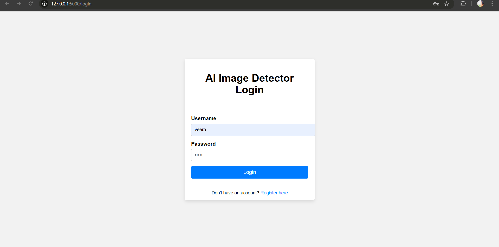
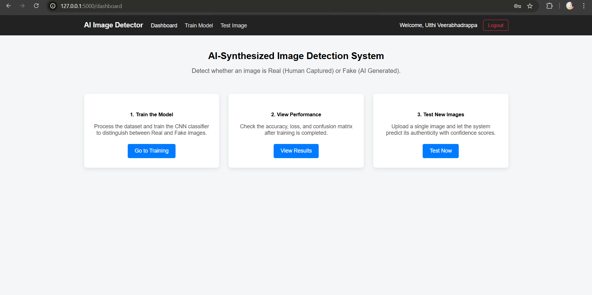
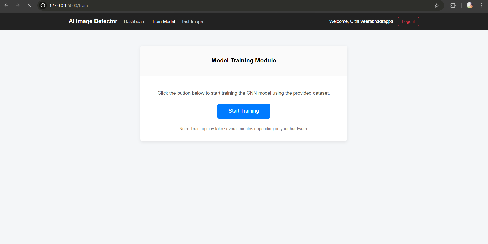
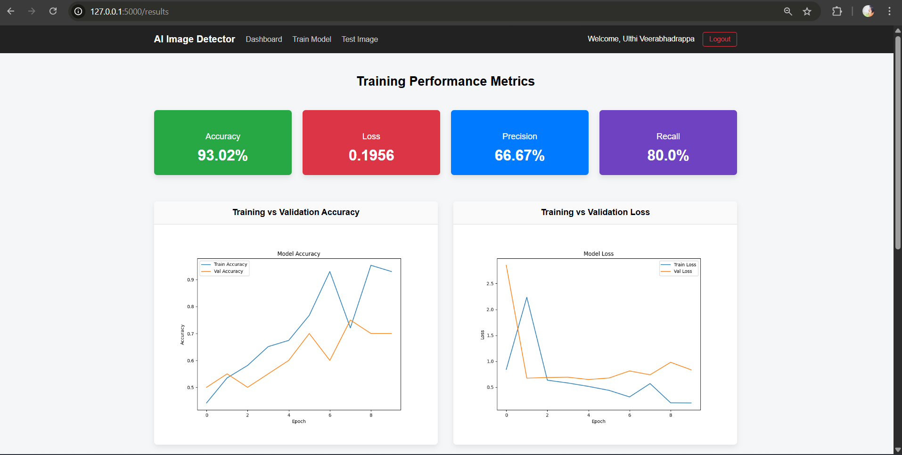
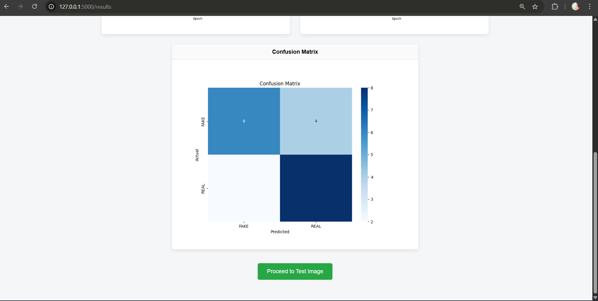
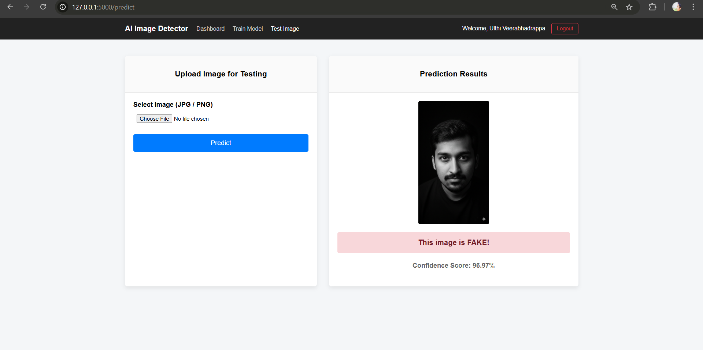
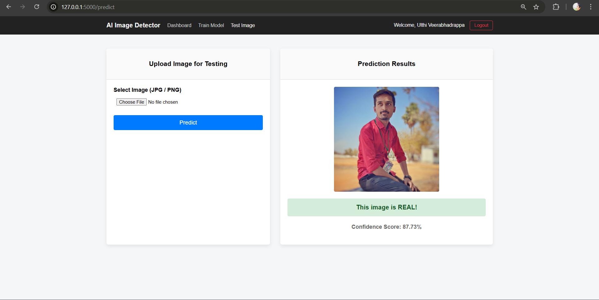

# AI Image Authenticity Detector

##  Overview

This project is a full-stack AI-based web application that detects whether an image is **Real (human-captured)** or **Fake (AI-generated)** using a Convolutional Neural Network (CNN).

The system is inspired by **digital image forensics** and uses deep learning techniques to identify hidden patterns in images.

---

##  Features

* User Authentication (Login/Register)
* CNN Model Training from dataset
* Performance Metrics (Accuracy, Loss, Precision, Recall)
* Graph Visualization (Training vs Validation)
* Image Testing Module
* Real-time Image Prediction
* Confusion Matrix visualization

---

##  Model Details

* Architecture: CNN (Keras / TensorFlow)

* Input Size: 224x224 images

* Classes:

  * REAL (Human captured)
  * FAKE (AI generated)

* Evaluation Metrics:

  * Accuracy: ~93%
  * Precision: ~66%
  * Recall: ~80%

---

##  Tech Stack

**Frontend:**

* HTML, CSS 

**Backend:**

* Flask (Python)

**Machine Learning:**

* TensorFlow / Keras
* OpenCV
* NumPy

**Database:**

* SQLite

---

##  Project Structure

```
project/
│
├── app.py                # Main Flask app
├── database.db          # SQLite DB
├── requirements.txt
│
├── model/
│   └── image_detector.h5
│
├── utils/
│   ├── model.py
│   ├── preprocess.py
│   └── train.py
│
├── templates/
├── static/
├── Dataset/
```

---

## ⚙️ Installation

### 1. Clone the repository

```bash
git clone https://github.com/veerabhadra05/ai-image-authenticity-detector-flask-cnn.git

cd ai-image-authenticity-detector-flask-cnn
```

### 2. Create virtual environment

```bash
python -m venv venv
venv\Scripts\activate
```

### 3. Install dependencies

```bash
pip install -r requirements.txt
```

### 4. Run the application

```bash
python app.py
```

Open: http://127.0.0.1:5000/

---

## 📸 Screenshots

### 🔐 Login Page



### 📊 Dashboard



### 🧠 Training Module



### 📈 Results & Graphs




### 🧪 Prediction Output




---

## Team & Contributions

This project was developed as a team project.

### My Role : Team Leader & Full-Stack Developer
* Led project development and coordination
* Developed Flask backend
* Built frontend UI using HTML & CSS
* Integrated CNN model with web application
* Implemented authentication system
* Managed database and routing logic

### Team Contributions
* Dataset collection and preprocessing
* Model training support and evaluation

## 👤 Author

Ulthi Veerabhadrappa
B.Tech CSE Final Year
2022-2026